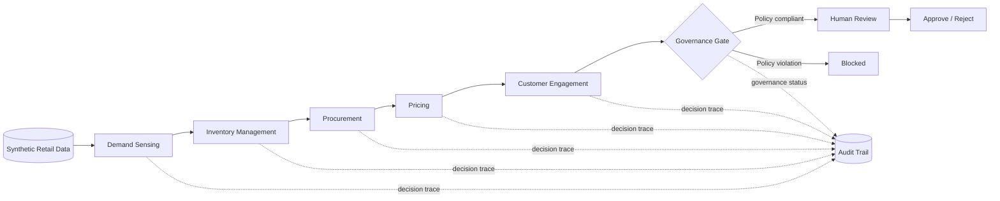

# Agentic Retail Portfolio

Governed multi-agent AI architecture for integrated retail decision support, human oversight and operational coordination.

[](https://github.com/debolujimi/agentic-retail-portfolio/actions/workflows/ci.yml)


## Overview

This repository presents a portfolio implementation of a governed multi-agent retail decision-support architecture. It demonstrates how specialised AI agents can coordinate across interconnected retail functions while preserving human oversight, traceability, modularity and testability.

The implementation uses synthetic retail data and representative decision logic so that the engineering architecture can be reviewed independently of the underlying doctoral research system.

## Architecture at a Glance



The five operational agents are deliberately bounded:

1. **Demand Sensing Agent** — estimates near-term demand from synthetic sales history.
2. **Inventory Management Agent** — assesses stock coverage and replenishment risk.
3. **Procurement Agent** — recommends replenishment quantities.
4. **Pricing Agent** — proposes bounded pricing actions.
5. **Customer Engagement Agent** — proposes customer-facing actions but does not send messages.

The governance layer evaluates cross-agent recommendations before they can progress to human review.

## Demonstration Flow

For the included fictional store `STORE-DEMO-001`, a run follows this pattern:

```text
Synthetic sales history
        ↓
Demand forecast
        ↓
Stock-cover / stockout-risk assessment
        ↓
Replenishment recommendation
        ↓
Bounded pricing recommendation
        ↓
Customer communication proposal
        ↓
Governance evaluation
        ↓
Human review required
```

A representative result contains the store and product identifiers, five structured agent decisions, a governance status, a human-review flag and an unset approval field. Approval authority therefore remains outside autonomous agent execution.

## Technology Stack

| Area | Portfolio implementation |
| --- | --- |
| Language | Python 3.11+ |
| Agent design | Modular specialised Python agents |
| State/contracts | Typed dataclasses and structured decision payloads |
| Governance | Policy-based gate with human-review escalation |
| Testing | pytest with deterministic synthetic fixtures |
| CI | GitHub Actions |
| Data | Synthetic retail scenarios only |
| Documentation | Markdown and Mermaid |

The full doctoral research implementation is broader than this portfolio. Technologies or capabilities not present in this repository should not be inferred from this demonstration.

## Engineering Focus

This portfolio demonstrates:

- multi-agent decomposition and orchestration;
- typed decision payloads and shared workflow state;
- human-in-the-loop approval;
- policy-based governance and fail-closed input validation;
- auditable decision traces;
- deterministic synthetic test data;
- automated testing with `pytest`;
- continuous integration with GitHub Actions;
- modular Python architecture.

## Quick Start

```bash
git clone https://github.com/debolujimi/agentic-retail-portfolio.git
cd agentic-retail-portfolio
python -m venv .venv
```

### Windows

```powershell
.venv\Scripts\Activate.ps1
```

### Linux/macOS

```bash
source .venv/bin/activate
```

Install dependencies and run:

```bash
python -m pip install --upgrade pip
python -m pip install -r requirements.txt
python -m demo.app
python -m pytest -q
```

## Repository Structure

```text
agentic-retail-portfolio/
├── .github/workflows/ci.yml
├── demo/
│   ├── agents/
│   ├── governance/
│   ├── synthetic_data/
│   ├── app.py
│   ├── models.py
│   └── workflow.py
├── docs/
│   ├── architecture.md
│   ├── engineering-decisions.md
│   ├── governance.md
│   └── testing-strategy.md
├── tests/
│   └── test_workflow.py
├── PORTFOLIO_SCOPE.md
├── SECURITY.md
├── requirements.txt
└── README.md
```

## Safety and Portfolio Scope

The demo uses fictional identifiers and synthetic inventory/sales values. It contains no real retailer, participant or field-study records, credentials, production configuration or unpublished participant findings.

See [PORTFOLIO_SCOPE.md](PORTFOLIO_SCOPE.md), [SECURITY.md](SECURITY.md), [architecture documentation](docs/architecture.md), [governance documentation](docs/governance.md) and [testing strategy](docs/testing-strategy.md) for further detail.

## Author

**Peter Olujimi**  
AI Engineer | Agentic AI Researcher | Applied AI & ML

- [GitHub](https://github.com/debolujimi)
- [LinkedIn](https://www.linkedin.com/in/peter-olujimi-0833a2b6/)
- [ORCID](https://orcid.org/0000-0002-9023-2328)
