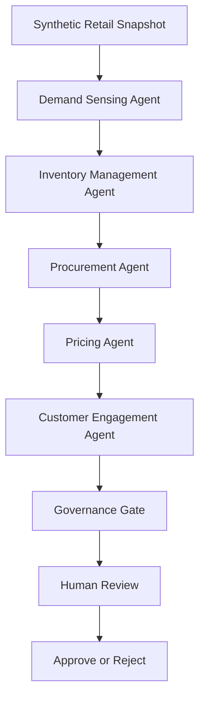

# Architecture

## Architectural Goal
The portfolio demonstrates a modular multi-agent workflow in which each agent owns a bounded operational responsibility and communicates through explicit structured state.

## Components
- **Demand Sensing Agent:** estimates demand from recent synthetic sales.
- **Inventory Management Agent:** assesses stock cover and stockout risk.
- **Procurement Agent:** recommends replenishment quantities.
- **Pricing Agent:** proposes deliberately bounded pricing actions.
- **Customer Engagement Agent:** proposes, but does not send, customer-facing actions.
- **Governance Gate:** evaluates combined recommendations before progression.
- **Human Review:** retains approval authority for consequential decisions.

## Data Flow

## Design Characteristics
- Modularity: agents can be independently replaced or tested.
- Traceability: every agent emits an explicit decision object.
- Governance: policy checks occur before operational approval.
- Human oversight: outputs are recommendations, not uncontrolled actions.
- Testability: deterministic synthetic rules make behaviour reproducible.
